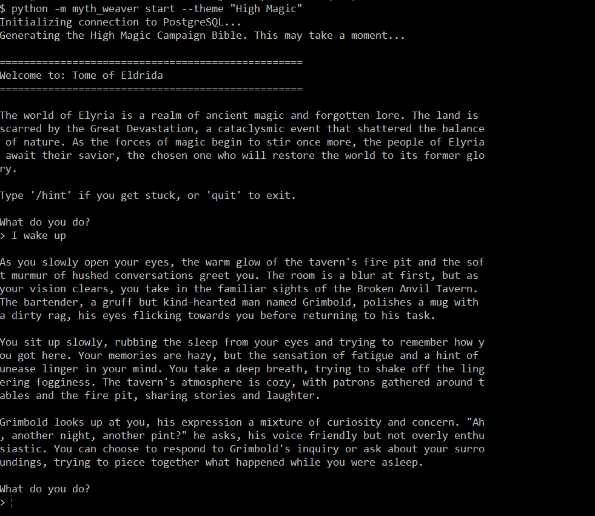

# 🐉 Myth Weaver

[](https://www.python.org/downloads/)
[](https://ollama.com/)
[](https://opensource.org/licenses/MIT)

> _Your fully local, procedurally generating AI Dungeon Master._

Myth Weaver is a locally hosted, text-based Dungeon Master application. It uses a custom Two-Pass LLM architecture with Ollama to handle both player intent parsing and narrative generation, while strictly relying on a C++ library that I created ([RollForge](https://github.com/sedna08/rollforge)) for deterministic game mechanics.

## 🌟 Highlights

Here are the main takeaways of what makes Myth Weaver unique:

- **🧠 Fully Local & Free:** Powered entirely by Ollama. Zero paid API dependencies.
- **🛡️ Hallucination Mitigation:** Uses a Two-Pass architecture with "State Injection" to keep the LLM strictly bound to reality. The LLM never guesses your HP or inventory.
- **🎲 Deterministic Mechanics:** All dice rolls, combat calculations, and skill checks are handled by our custom C++ engine, `RollForge`.
- **🗺️ Procedural Campaigns:** Automatically generates a persistent Campaign Bible (setting, quests, milestones) saved in a PostgreSQL database.
- **💡 Dynamic Hint System:** Supports active hints (`/hint`) and automated passive hints tied to your character's _Passive Perception_ if you get stuck\!

## ℹ️ Overview

A common problem with using LLMs for roleplaying games is that they easily lose track of the "truth" (e.g., forgetting your health, inventing items, or ignoring game rules).

Myth Weaver solves this by separating concerns. When you type an action, a fast **Intent Parser** analyzes what you want to do. If it requires a rule check, our Python backend passes it to the `RollForge` C++ engine to mathematically resolve the outcome. Finally, the **Storyteller LLM** is injected with the _exact_ current database state and the dice roll results, prompting it to generate a rich, accurate narrative response.

## 📸 Example Start Screen Shots

> _See Myth Weaver in action\!_

_Generating a new "High Magic" Campaign Bible._



## 🚀 Usage instructions

Once installed and running, starting a new adventure is as simple as running the CLI command and providing a theme for your procedural campaign:

```bash
python -m myth_weaver start --theme "High Magic"
```

Once inside the game loop, interact naturally with the DM. If you ever find yourself stuck, you can utilize the out-of-character command:

```text
What do you do?
> /hint

[DM Hint]: A mysterious glow emanates from the loose floorboards near the bartender...
```

Type `quit` or `exit` at any time to safely save your session to the database.

## ⬇️ Installation instructions

Myth Weaver requires **Python 3.12+**, **Docker** (for the database), and **Ollama** installed on your system.

1.  **Clone the repository and install dependencies:**
    We use `uv` for fast dependency management.

<!-- end list -->

```bash
git clone https://github.com/yourusername/myth-weaver.git
cd myth-weaver
uv pip install -e ".[dev]"
uv pip install python-dotenv
```

2.  **Start the PostgreSQL Database:**
    Copy `.env.example` to `.env` and configure your credentials, then spin up the container:

<!-- end list -->

```bash
docker compose up -d
```

3.  **Initialize the LLM:**
    Ensure your Ollama background service is running, then pull the required Llama 3 model:

<!-- end list -->

```bash
ollama pull llama3
```

## ⚠️ Limitations

While Myth Weaver is a powerful local engine, it currently has a few constraints:

- **Strictly Single-Player:** The architecture, database schema, and `RollForge` session state are currently designed around a solo player character. There is no multiplayer or turn-order support yet.
- **Hardware Dependent:** Because it relies entirely on local LLMs (like the 8-billion parameter Llama 3 model), narrative generation speed is directly tied to your machine's CPU/GPU capabilities.
- **Mechanics Scope:** Deterministic mechanics are currently limited to the interactions supported by the `RollForge` C++ wrapper (basic combat, HP tracking, standard skill checks).
